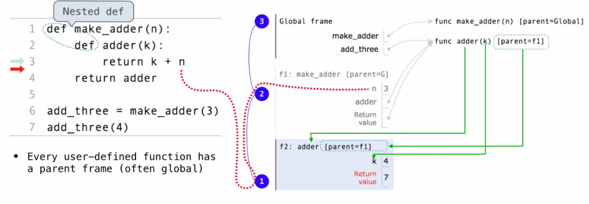

### Course
[CS61A](https://inst.eecs.berkeley.edu/~cs61a/su20/)

---
### Notes
#### Pure Functions
Pure functions have the property that applying them has _no effects_ beyond returning a value. Moreover, a pure function must always return the _same value_ when called twice with the same arguments
```python
abs(-2) # pure
print(1) # non-pure  display 1 and return none
```

---
#### Higher Order Functions
A **higher order function**(HOF) is a function that manipulates other functions by taking in functions as arguments, returning a function, or both.

A powerful **abstraction** tools that allow us to express certain general patterns as named concepts in our programs.

```python
def compose1(f, g): # function(s) as auguments
    def h(x):
        return f(g(x))
    return h # return a function
```
##### Curring
Convert a function that takes multiple arguments into a chain of functions that each take a single argument.
```python
def curried_pow(x):
    def h(y):
        return pow(x, y)
    return h

curried_pow(2)(3)
```
pow(x, y) => curried\_pow(2)(3)

---
#### Environment
An environment is a sequence of frames.
- The global frame alone
- A local, then the global frame

For example:
```python
from operator import mul
def square(x):
    return mul(x, x)

square(square(3))
```
1. At first, we are in global frame which is the last frame in the environment.
2. Then to evaluate square(3), we get into the local frame f1: square [parent=Global], then we got 9 and back to global frame.
3. Then to evaluate square(9), we get into the local frame f2: square [parent=Global], then we got 81 and back to global frame.

##### What's more?
1. Every expression is evaluated in the context of an environment.
2. A name evaluates to the value bound to that name in the earliest frame of the current environment in which that name if found.
    - like the example above: the value of square which is in the global frame is a function, but when you call it, you will get into its local frame.

##### What about nested function?

In the picture, the nested function *adder* can use **n** coming from current frame, but you can't change the **n** without do anything

Q:
1. When I used python tutor for the code above, it did not get into the mul's local frame. I didn't know if it was because that function is predefined.
